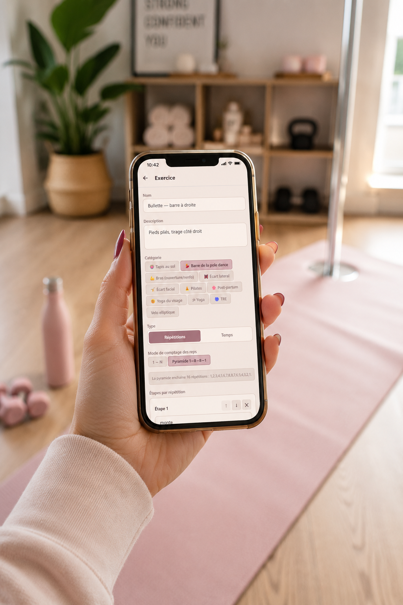

# Nawell 🌱

**A mobile companion that lets you design your workout sessions exactly the way you want.**

<p align="center">
  
</p>

📖 Product page: [thehumanbehindai.com/nawell-app](https://thehumanbehindai.com/index.php/nawell-app/)

## Concept

You build the exercises, the categories, the vocal counting modes. The app organises, you decide.

Fits calisthenics, pole dance, mobility, yoga, pilates, stretching — any practice where pre-made programs miss the point.

## Three beliefs

1. Training fits you, never the other way around
2. The app organises your knowledge — it never replaces it
3. Simplicity beats algorithmic noise — honest tracking, guilt-free

## What Nawell does

- 🎙 **Voice coaching** — the voice guides each exercise, step, and count. Screen or no screen.
- 🗂 **10 default categories** (Pole dance, Floor mat, Side splits, Front splits, Post-partum, Arms, Pilates, Yoga, Face Yoga, TRE) — extensible with your own
- 🔢 **Counting modes** — linear, reverse, 1→8→8→1 pyramid, silent, or your own vocal sequences (4-7-8 breathing, rhymed count, dance tempo…)
- ⚖ **Weight tracking** — planned vs actual curve, daily entry, custom target, retroactive input
- 🎨 **4 visual palettes** — Roses, Pop Art, Graphite, Storm
- 🎵 **Background music** — local mp3 or URL, mixed with the coach voice
- 📊 **CSV Import/Export** — structure your routines in Excel, Google Sheets or Numbers, import in one click

## Tech stack

- **Expo** (React Native) — iOS, Android, Web from a single codebase
- **TypeScript**
- **Native SVG** for the weight chart
- **AI-native development** with Claude Code

## Run locally

```bash
git clone https://github.com/AgnieszkaPytel/nawell.app.git
cd nawell.app
npm install
npx expo start
```

- **Web** — open the `localhost:8081` URL shown in the terminal
- **Mobile** — scan the QR code with [Expo Go](https://expo.dev/go)

## Status

Android beta in preparation — [join the early-bird community](https://thehumanbehindai.com/index.php/nawell-app/).

---

Built by [Agnieszka Pytel](https://thehumanbehindai.com) — AI Product Builder based in Nantes.
